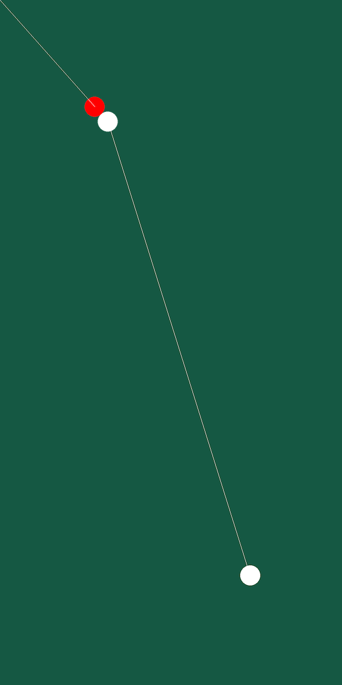
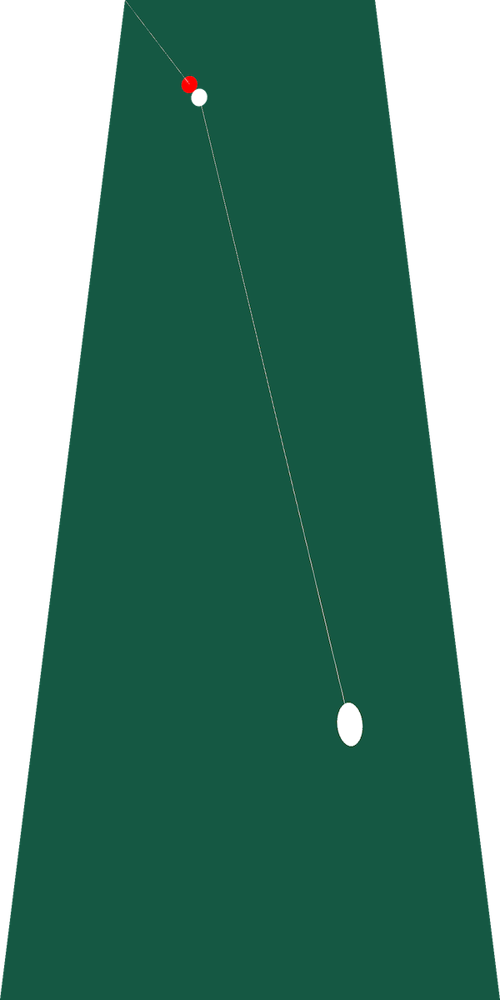

# Drill Image Script (DIS)

---

### Table of Contents

- Description
    - String representation
- Methodology
- Classes
    - `Table`
    - `Ball`
        - `CueBall`
        - `GhostBall`
        - `CalledBall`
        - `Pocket`
- Functions
    - `parse()`
    - `generate()`
- Samples
- Dependencies

---

### Description

DIS is a Python script written to generate an image of a billiards drill involving a single called ball being put in a
pocket, using a string representation as input.

#### String representation

The string representation used for this script is a series of `';'`-separated left `0`-padded `float` pairs, elements of
which are `','`-separated. The pairs specify the xy coordinates of the cue ball, ghost ball, called ball, and pocket (in
this order), followed by an 8-digit number specifying the successful and total hits per drill in the first and second
4-digit halves respectively.

For example:

```python
'072.4188,166.2855;031.2016,035.1107;027.4153,030.8499;000.0,000.0;00120025'
```

identifies a drill where the cue ball, ghost ball, and called ball are located in `(72.4188, 166.2855)`
, `(31.2016, 35.1107)`, and `(27.4153, 30.8499)` respectively. The target pocket is the farther left corner pocket
i.e. `(0, 0)`, and there are `12` successful / 25 total shots recorded.

---

### Methodology

The script first parses the string representation to obtain the drill parameters, then uses custom object classes to
draw the billiards balls, and calculate trajectories between the balls. These trajectories are later drawn as lines. The
resulting rectangular image of the pool table is then warped using precomputed coefficients.

These coefficients are computed as follows:

```python
import numpy as np


def find_coeffs(pa, pb):
    matrix = []
    for p1, p2 in zip(pa, pb):
        matrix.append([p1[0], p1[1], 1, 0, 0, 0, -p2[0] * p1[0], -p2[0] * p1[1]])
        matrix.append([0, 0, 0, p1[0], p1[1], 1, -p2[1] * p1[0], -p2[1] * p1[1]])

    A = np.matrix(matrix, dtype=float)
    B = np.array(pb).reshape(8)

    res = np.dot(np.linalg.inv(A.T * A) * A.T, B)
    return np.array(res).reshape(8)
```

This function requires linear algebraic calculations, necessitating the use of the `numpy` package. Due to the
memory-intensive nature of linear algebra, and the need to include more packages, makes it more feasible to precompute
these coefficients, especially since the coefficients are fixed for image dimensions.

Using `1200x2400` resolution, the coefficients for a `2:1` width:distance ratio are as follows:

```python
[2.00000000e+00, 2.50000000e-01, -6.00000000e+02, 1.06814613e-13,
 2.00000000e+00, -7.45505545e-12, 7.49741597e-18, 4.16666667e-04]
```

The warped image is then serviced to the projector.

---

### Classes

#### Table

The `Table` class is used to hold the specifications of the pool table. These parameters include `width`, `height`, and
`radii`, specifying the short and long edges of the pool table, and the radius of the billiards balls respectively.

#### Ball

The `Ball` class is a parent class inherited by specific ball classes, containing the general properties of the pool
balls. The general properties are the ball coordinates, scale taken from the `Table`, and color. This class also has
methods called `get_xy()` and `get_trajectory()` which return the `xy` parameter used to draw ellipses and lines, in
that order.

##### CueBall

The `CueBall` class inherits and instantiates the `Ball` class with the cue ball color.

##### GhostBall

The `GhostBall` class inherits and instantiates the `Ball` class with the ghost ball color.

##### CalledBall

The `CalledBall` class inherits and instantiates the `Ball` class with the called ball color.

#### Pocket

The `Pocket` class inherits and instantiates the `Ball` class with the pocket color. While the pocket is not in any way
a type of ball, the properties for the purposes of the script are the same.

---

### Functions

#### parse( )

The `parse()` function takes the string representation and the table scale, and parses the string representation,
scaling the floats accordingly. The function then returns the instantiated objects for the balls and the pocket.

#### generate( )

The `generate()` function generates and returns the image, drawing the objects passed as arguments to the function,
alongside the trajectories between these object coordinates calculated within the function.

---

### Samples

|              Orthogonal Image              |              Perspective Image               |
|:------------------------------------------:|:--------------------------------------------:|
|  |  |

### Dependencies

This script is written in `Python3`, and uses the `typing` and `pillow` package contents, imported as follows:

```python
from typing import Tuple
from PIL import Image, ImageDraw
```